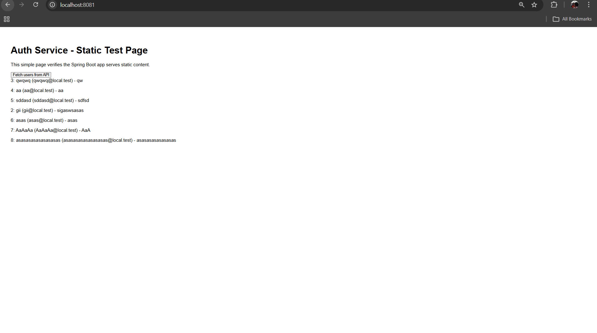
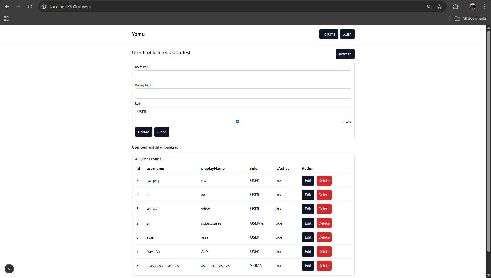

**YOMU — be-auth**

Panduan cepat menjalankan service `auth` secara lokal.

**Prerequisites**

- Java 21
- Git (opsional)
- Koneksi internet untuk akses Supabase

**Setup environment**

1. Salin file contoh environment ke file lokal yang tidak dikomit:

```powershell
copy .env .env.local
```

2. Edit .env.local dan isi credential Supabase.

Atau set variabel terpisah jika tidak menggunakan `JDBC_DATABASE_URL`:

```text
DB_HOST=YOUR_HOST
DB_PORT=5432
DB_NAME=postgres
DB_USER=postgres
DB_PASSWORD=YOUR_PASSWORD
```

**Menjalankan aplikasi (lokal)**

- Gunakan Gradle wrapper untuk menjalankan aplikasi:

```powershell
# Windows / PowerShell
.\gradlew.bat bootRun

# macOS / Linux
./gradlew bootRun
```

Server akan tersedia pada port sesuai `SERVER_PORT` (default 8081). Anda dapat membuka http://localhost:8081/

**Build jar dan jalankan**

```powershell
./gradlew bootJar

# Jalankan jar
java -jar build/libs/*.jar
```

**Menjalankan dengan variabel di PowerShell (sesi sementara)**

```powershell
$env:JDBC_DATABASE_URL='...'
.\gradlew.bat bootRun
```

**Testing**

```powershell
./gradlew test
```

**Catatan penting**

- Pastikan kredensial database benar dan IP/host tidak diblokir oleh firewall.
- Jika port 8080 gunakan port 8081 (disini saya menggunakan port 8081)
- Untuk verifikasi JWT Supabase, isi `SUPABASE_URL` dan (opsional) `SUPABASE_JWKS_URL` di environment.

Integrasi Sederhana yang nunjukkin be, fe dan db terconnect



